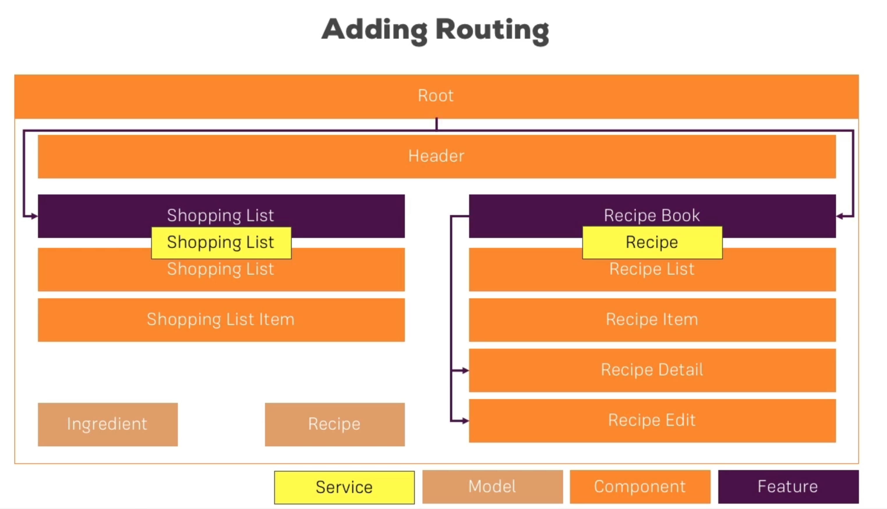

# Routing - Course Project

### Planning the General Structure

* Adding RecipeEdit Component
* 

### Setting Up Routes

* Setting up recipe and shopping-list routes
```sh
# ng generate module app-routing --flat --module=app
ng g m app-routing --flat --module=app

# --flat puts the file in src/app instead of its own folder.
# --module=app tells the CLI to register it in the imports array of the AppModule
```
* Need to add imports and exports for RouterModule in app routing module
* Use of router-outlet in app component's template

### Adding Navigation to the App

* I had changed header template in last lecture itself(routerLink), now just need to remove those methods in Header Component

### Marking Active Routes

* Add routerLinkActive to both the li in header component's template

### Fixing Page Reload Issues

* Author had to add style:"cursor: pointer;" to get that hand pointer but for me it was already there
  * Maybe bootstrap does it for me

### Child Routes Challenge

* I had already implemented this in Setting Up Routes section itself
  * But there I used recipe names, maybe now let's use the index

### Adding Child Routing Together

* Add route for recipe-start in app routing
```sh
ng g c recipes/recipe-start --skip-tests true
```

### Configuring Route Parameters

* I had already implemented this in Setting Up Routes section itself
* Author used 'id' as property in recipe detail and added a method to get a recipe by index in recipe service

### Passing Dynamic Parameters to Links

* Change in recipe-item(I had already done in Setting Up Routes)
* Author used relative path, whereas I used absolute path

### Styling Active Recipe Items

* Just add routerActiveLink="active" in recipe item's template

### Adding Editing Routes

```sh
ng g c recipes/recipe-edit --skip-tests true
```
* Register new route for the above edit component
* We'll get the below error if new route is before id in recipes children routes
```
TypeError: Cannot read properties of undefined (reading 'name')
```
* So we need to switch the order

### Retrieving Route Parameters

* Changes in recipe-edit component
* Add id and editMode properties in RecipeEdit and subscribe to param changes in ngOnInit to initialize id and reassign editMode
* Also change links in New and Edit Recipe

### Programmatic Navigation to the Edit Page

* I had used routerLink to navigate but Author used Programmatic navigation

### One Note about Route Observables

* Angular will do the cleanup work for Parmas Observables we set up in Recipe Edit and Detail components
* But remember to clean up for our own Observables